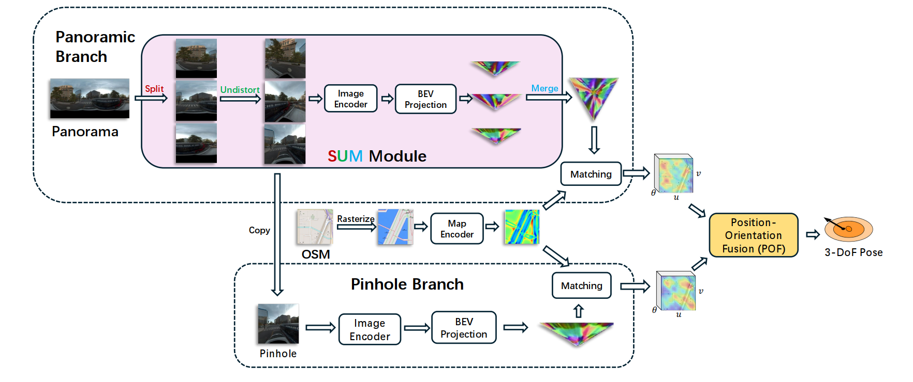

# [CVPR 2026]: RHO: Robust Holistic OSM-Based Metric Cross-View Geo-Localization



This repository hosts the source code for RHO. 
Compared with existing cross-view geolocalization algorithms that rely on 3D point clouds and satellite images, 
RHO estimates position and orientation using holistic panoramas and OpenStreetMap (OSM).
RHO contains a two-branch Pin-Pan architecture for accurate visual localization.
A Split-Undistort-Merge (SUM) module is introduced to address the panoramic distortion,
and a Position-Orientation Fusion (POF) mechanism is designed to enhance the localization accuracy.
Extensive experiments on CV-RHO dataset prove the SOTA and robust performance of the RHO model.

## Installation

Clone the repo and install the requirements:

```bash
git clone https://github.com/AtmanDai/RHO.git
cd RHO
python3 -m pip install -r requirements/full.txt
```

## Download the dataset

CV-RHO Dataset will be released soon.

## Evaluation

Run the evaluation

```bash
python3 -m maploc.evaluation.mapillary_pano --experiment RHO_clean model.num_rotations=256
```
The result should be close to the following:
```bash
Recall xy_max_error: [24.59, 73.55, 84.36] at (1, 3, 5) m/°
Recall yaw_max_error: [43.46, 83.61, 90.44] at (1, 3, 5) m/°
```
The default setting of the number of rotations in evaluation is 256. If you run into OOM issues, consider reducing it.

You could also visualize some of the prediction results by running the viz_pred_pano.py
```bash
python3 visualization/viz_pred_pano.py --data_dir YOUR_DATA_PATH --out_dir OUTPUT_PATH --experiment RHO_clean
```

## Training

You could fine-tune the RHO model with your own dataset.

```bash
python3 -m maploc.train data=YOUR_DATA_CONFIG experiment.name=RHO_finetuned training.finetune_from_checkpoint=''experiments/RHO_clean/best-checkpoint.ckpt'
```

